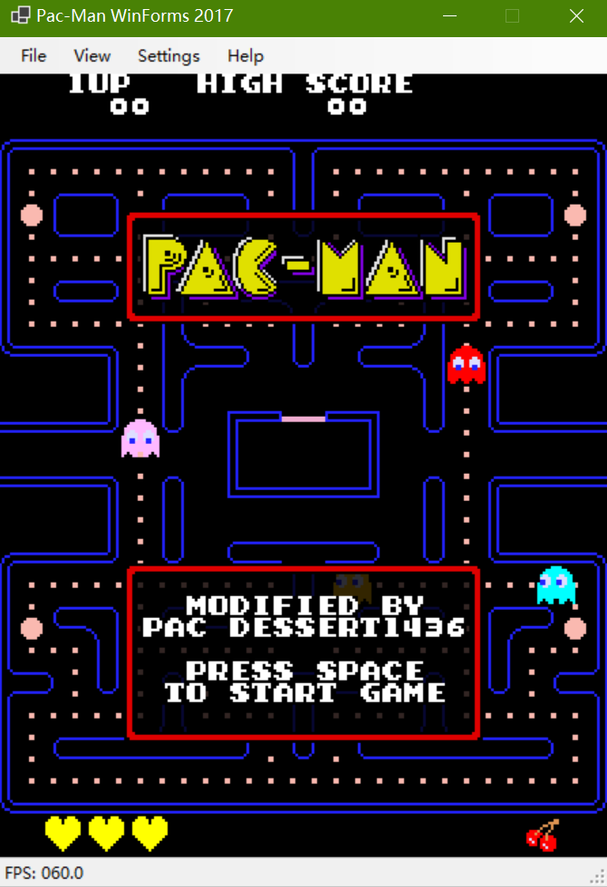
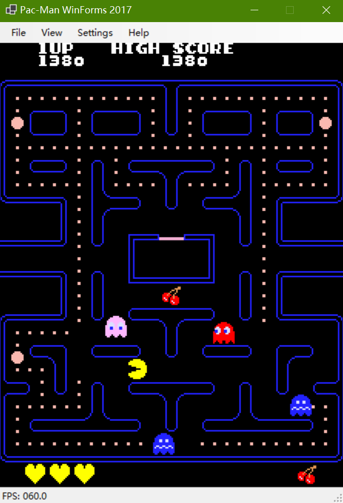
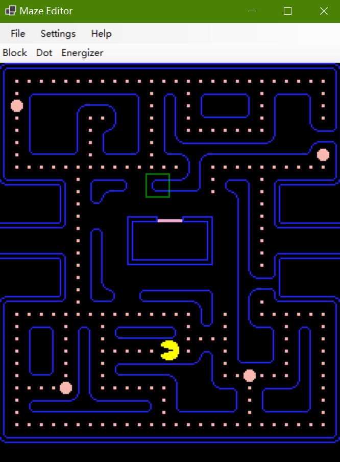
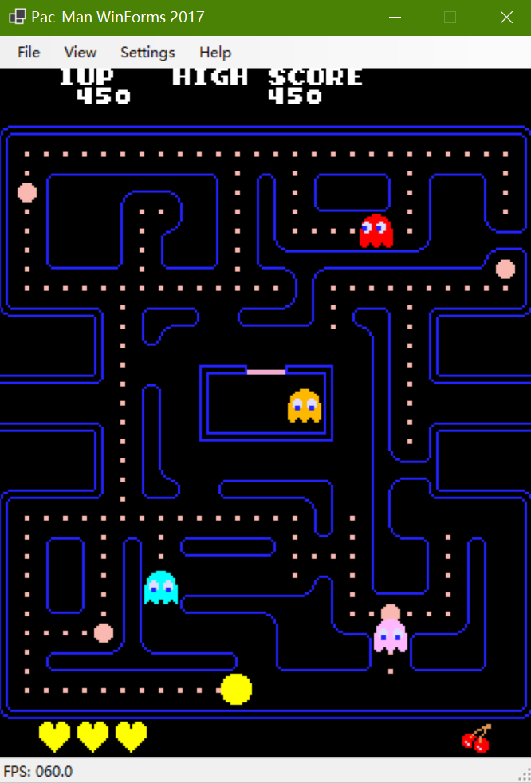

# Pac-Man WinForms 2017 (Modified by Pac-Dessert1436)

## Description
This project is a fully functional, modernized Pac-Man game built with VB.NET WinForms, originally based on [Matt Jones' 2017 project](https://github.com/matthewjones089/Pac-Man). This modified version features updated visuals and improved framework compatibility while preserving the classic gameplay experience.

## Key Enhancements
- Modernized visual style with updated game font (inspired by Namco's _Pac-Man Arrangement 1996_) and refreshed sprites
- Upgraded from **.NET Framework 4.5** to **.NET 9.0** for improved performance and compatibility
- Implemented audio playback using `NAudio` library with a thread-safe `AudioPlayer` class:
    - **Sound effects**: original _Pac-Man_ and _Super Pac-Man_ (both arcade version)
    - **Background music**: "P.A.R.T.Y. - Universe Festival" from anime _Kamen Rider Zi-O Over Quartzer_
- Resolved all compiler warnings and naming convention issues, including enum members
- Full compatibility with Visual Studio 2022/2026

### Features
- Authentic arcade-style ghost AI
- Faithful recreation of classic Pac-Man gameplay mechanics
- Reusable threaded game engine supporting tiles, maps, fonts, and sprites
- Built-in maze editor for designing custom levels
- Thread-safe audio system with synchronization locks (`SyncLock`) for safe playback

### Current Limitation
- Single-player mode only

## About
This project originated from Matt Jones' **A-Level AQA Non-Exam Assessment 2017**, developed in Visual Basic 2012. While modernized to .NET 9.0 and Visual Studio 2022/2026, it retains the nostalgic charm and gameplay of the original arcade classic.

## Screenshots
**Updated Title Screen**:  
  

**Classic Gameplay**:  

**Maze Editor (Weird but works)**:  

**Custom Level**:  

## License
This project is licensed under the MIT License. See the [LICENSE](LICENSE) file for details.