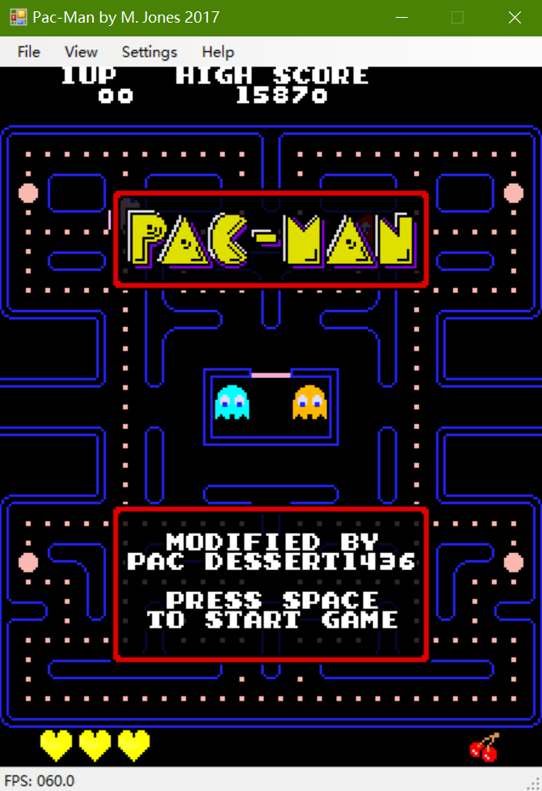

# Pac-Man (Modified Fork)
A customized version of the Pac-Man project in VB.NET WinForms, [original work](https://github.com/matthewjones089/Pac-Man) by Matt Jones in 2017.  
A fully functioning, playable Pac-Man game with updated visuals and framework compatibility.

**Modifications by Pac-Dessert1436**:  
- Updated game font and partial in-game sprites for a refreshed visual style.  
- Upgraded target framework from .NET Framework 4.5 to .NET Framework 4.8.
- Fixed all the compiler warnings, including the naming convention problems.
- Project now compatible with **Visual Studio 2022**.  

---

### Key Features
- Arcade-accurate ghost AI  
- Accurate recreation of original gameplay mechanics  
- Re-usable threaded game engine supporting tiles, maps, fonts, and sprites  
- Integrated maze editor for creating custom mazes  

### Missing Features  
- No audio support  
- Single-player mode only  

---

### About  
Originally developed for the **A-Level AQA Non Exam Assessment 2017** in Visual Basic 2012, this project has been updated to modern standards.  
**Changes in this fork**:  
- Migrated to **.NET Framework 4.8** for improved compatibility.  
- Visual Studio 2022 support.  
- Custom fonts and redesigned sprites.  

**Asset Note**:
Assets are loaded from the Debug and Release folder.

---

### Screenshots  
*(Note: Screenshots below, apart from the first one, reflect the original project; visuals differ in this fork due to font and sprite changes.)*  

**Modified Title Screen**:  
  

**Pac-Man Maze in Action (Original)**:  
  

**Map Editor (Original)**:  
  

**Custom Maze in Action (Original)**:  
  